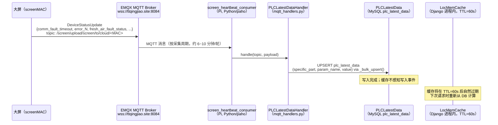
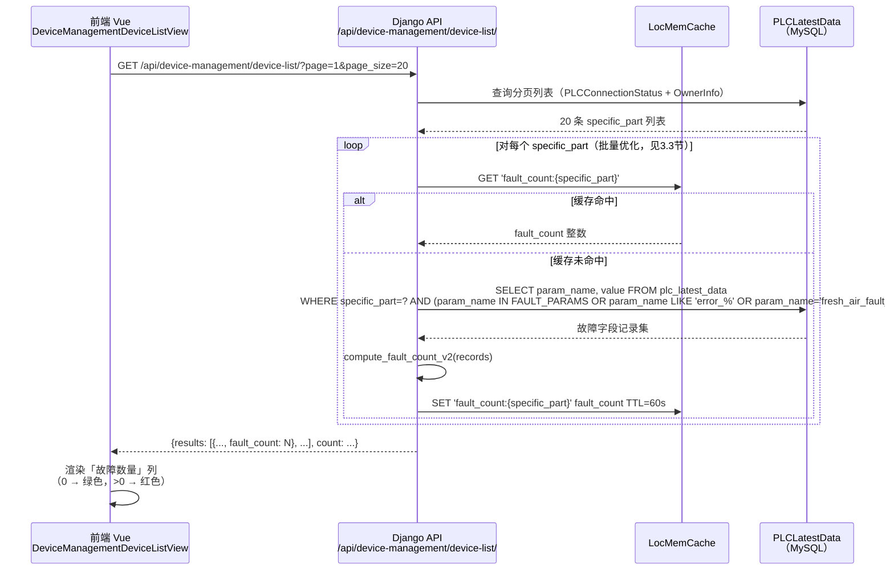
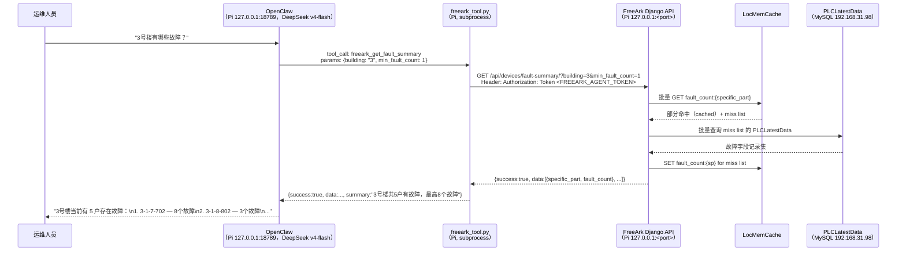

# 架构设计文档

```
file_header:
  document_id: ARCH-v0.5.3-FCC
  title: 设备列表「故障数量」列 + OpenClaw 故障查询工具 — 架构设计
  author_agent: sub_agent_system_architect (via PM Orchestrator)
  project: FreeArk 能耗采集平台
  version: v0.5.3-fault-count-column
  created_at: 2026-05-26
  status: DRAFT
  references:
    - docs/requirements/v0.5.3_fault_count_column/requirements_spec.md
    - docs/requirements/v0.5.3_fault_count_column/user_stories.md
    - FreeArkWeb/frontend/src/views/DeviceManagementDeviceListView.vue
    - FreeArkWeb/frontend/src/views/DeviceCardsView.vue
    - FreeArkWeb/backend/freearkweb/api/models.py
    - FreeArkWeb/backend/freearkweb/api/mqtt_handlers.py
    - FreeArkWeb/backend/freearkweb/api/mqtt_consumer.py
    - FreeArkWeb/backend/freearkweb/api/views.py
    - FreeArkWeb/backend/freearkweb/api/urls.py
    - agents/freeark-skill/SKILL.md
```

---

## 1. 设计目标与约束

### 1.1 核心目标

| 目标 | 具体要求 |
|------|---------|
| 性能优先 | 严禁查询 `device_param_history`（3766 万行/11.3GB）；所有故障计算基于 `PLCLatestData`（每设备每参数 1 条）|
| 故障定义复用 | 与 `DeviceCardsView.vue`（`FAULT_PARAMS` + `comm_fault_timeout` + `error_<N>`）完全对齐，不重复定义 |
| 最小侵入 | 不改动任何现有 API 响应结构，不修改 `DeviceCardsView.vue`，不修改 MQTT 消费框架 |
| 无额外基础设施 | 生产环境为树莓派（192.168.31.51），无 Redis，缓存使用 Django 进程内缓存（`LocMemCache`）|

### 1.2 关键约束

- 树莓派内存约 4GB，进程内缓存需设置合理上限
- 生产数据库 MySQL 192.168.31.98:3306，`PLCLatestData` 表有 `(specific_part, param_name)` 唯一索引可高效利用
- MQTT broker 为公网 EMQX（`wss://www.ttqingjiao.site:8084/mqtt`），心跳 consumer 已在生产中运行
- 所有部署通过 `git pull` 完成，无 Docker

---

## 2. 架构决策记录（ADR）

### ADR-FC-001：缓存层选型——Django 进程内缓存（LocMemCache）

**问题**：故障数量每次分页都重新计算代价较高，需要缓存，但树莓派无 Redis。

**方案评估**：

| 方案 | 优点 | 缺点 |
|------|------|------|
| A：不缓存，每次实时计算 | 最新数据，无一致性问题 | 每次分页 20 条需跑 20 个子查询，P95 可能超 500ms |
| B：Django LocMemCache（本方案）| 零额外基础设施，进程内命中无网络 IO | 重启后缓存丢失；多 worker 进程间缓存不共享 |
| C：Redis | 跨进程共享，TTL 精确控制 | 需要安装运维 Redis，树莓派额外内存压力 |
| D：数据库计算列（存入 PLCConnectionStatus）| 查询成本低 | 需 migration，MQTT 更新需更新额外字段 |

**决策**：采用方案 B（Django LocMemCache）+ **短 TTL 定时刷新**（OQ-01 裁决后修订，废止 MQTT 事件驱动失效；详见 ADR-FC-005）。

**理由**：
1. 生产环境无 Redis，方案 C 不可用。
2. `waitress` 生产部署使用多线程（单进程），LocMemCache 对同进程内所有线程共享，缓存命中率高。
3. OQ-01 裁决：故障数据来源仅为 `plc_latest_data` 表，不再依赖 MQTT 报文触发失效；缓存由 TTL=60s 自动刷新，实现最简，满足需求延迟约束。
4. 冷启动/进程重启后，首次请求触发实时计算并填充缓存，代价一次性可接受。

**缓存 Key 设计**：`fault_count:{specific_part}`（如 `fault_count:3-1-7-702`）

**缓存 TTL**：**60 秒**（ADR-FC-005 修订值；满足 US-FC-05 AC-FC-05-01 的 ≤60s 延迟要求）

**最大条目数**：2000 个 specific_part（与 OwnerInfo 规模匹配），内存占用约 < 1MB。

---

### ADR-FC-002：故障判定逻辑归集——后端 Python 集中定义

**问题**：故障字段定义在前端 `DeviceCardsView.vue`（`FAULT_PARAMS` 集合），若后端查询也需要故障判定，如何避免两套定义？

**方案评估**：

| 方案 | 优点 | 缺点 |
|------|------|------|
| A：前端维护唯一 | 定义在前端，已有实现 | 后端无法复用，且前端改动需同步后端逻辑 |
| B：后端维护唯一（本方案）| 后端 Python 集中定义，前端通过 API 获取 | 前端已有定义需与后端保持一致（但本次不改前端 JS 定义）|
| C：共享配置文件（JSON）| 前后端均从同一文件读取 | 工程复杂度高，不符合现有架构风格 |

**决策**：采用方案 B。在后端新建 `api/fault_utils.py` 模块，集中定义故障参数识别逻辑，供所有视图和 MQTT handler 调用。前端 `DeviceCardsView.vue` 中的 `FAULT_PARAMS` 集合保持不变（向后兼容），两者以"前端定义 = 后端定义的子集"关系维护一致性（如双方均包含 `living_room_temp_sensor_error`，后端额外覆盖 `comm_fault_timeout` 和 `error_<N>` 正则模式）。

**故障识别规则（Python 实现）**：
```python
import re

FAULT_PARAM_NAMES = frozenset([
    # 温控面板（5 个房间 × 4 个故障字段 = 20）
    'living_room_temp_sensor_error', 'living_room_humidity_sensor_error',
    'living_room_external_temp_sensor_error', 'living_room_communication_error',
    'study_room_temp_sensor_error', 'study_room_humidity_sensor_error',
    'study_room_external_temp_sensor_error', 'study_room_communication_error',
    'bedroom_temp_sensor_error', 'bedroom_humidity_sensor_error',
    'bedroom_external_temp_sensor_error', 'bedroom_communication_error',
    'children_room_temp_sensor_error', 'children_room_humidity_sensor_error',
    'children_room_external_temp_sensor_error', 'children_room_communication_error',
    'fourth_children_room_temp_sensor_error', 'fourth_children_room_humidity_sensor_error',
    'fourth_children_room_external_temp_sensor_error', 'fourth_children_room_communication_error',
    # 其他子设备故障字段
    'fresh_air_unit_stop_error', 'fresh_air_unit_communication_error',
    'hydraulic_module_low_temp_error',
    'energy_meter_status_communication_error',
    'air_quality_sensor_communication_error',
    # PLC 通信故障
    'comm_fault_timeout',
])

_ERROR_N_PATTERN = re.compile(r'^error_\d+$')

def is_fault_param(param_name: str) -> bool:
    """判断 param_name 是否属于故障字段。
    覆盖两类：
    1. FAULT_PARAM_NAMES 中的具名故障字段（含 comm_fault_timeout）
    2. error_<N> 模式的故障码位字段
    不覆盖 fresh_air_fault_status（位域原始值，位展开另行处理，见 ADR-FC-003）
    """
    return param_name in FAULT_PARAM_NAMES or bool(_ERROR_N_PATTERN.match(param_name))

def compute_fault_count(records) -> int:
    """计算一个 specific_part 下的故障总数。
    records: iterable of (param_name, value) 元组
    """
    count = 0
    for param_name, value in records:
        if is_fault_param(param_name) and value is not None and value != 0:
            count += 1
    return count
```

---

### ADR-FC-003：fresh_air_fault_status 位域处理

**问题**：新风机 `fresh_air_fault_status` 字段是 9 位位域整数，`DeviceCardsView.vue` 将其展开为 9 个独立的 `fresh_air_fault_bit_0` 到 `fresh_air_fault_bit_8` 字段显示。后端 `PLCLatestData` 中存储的是原始整数值（`fresh_air_fault_status`），不存储展开后的位值。

**决策**：故障计数时，对 `fresh_air_fault_status` 字段统计其二进制表示中非零位数（popcount），而非仅判断整体是否非零。这样与设备面板"每个故障位 = 1 个故障"的展示口径一致（解决开放问题 OQ-03）。

**实现**：
```python
def compute_fault_count_v2(records) -> int:
    count = 0
    for param_name, value in records:
        if value is None or value == 0:
            continue
        if param_name == 'fresh_air_fault_status':
            # 按位计数：每个置 1 的 bit 算 1 个故障
            count += bin(int(value)).count('1')
        elif is_fault_param(param_name):
            count += 1
    return count
```

---

### ADR-FC-004：REST API 路径设计

**决策**：新增独立 API 端点 `GET /api/devices/fault-count/`，与现有 `/api/devices/realtime-params/`、`/api/devices/param-history/` 对齐，挂载在 `devices/` 命名空间下。

故障数量字段 `fault_count` 同时追加到 `/api/device-management/device-list/` 的每条响应记录中（避免前端额外请求）。

**不采用**：将故障数量作为 WebSocket 推送（减少实现复杂度，前端刷新列表时自然获取最新值）。

---

### ADR-FC-005：缓存刷新策略——短 TTL 定时刷新（OQ-01 裁决修订）

> **版本说明**：本 ADR 由 OQ-01 用户裁决（2026-05-26）修订。原方案（MQTT 事件驱动缓存失效）已废止，原因是 v0.5.3 暂不依赖 MQTT upload 报文作为故障数据来源，仅从 `plc_latest_data` 表读取。

**问题**：故障数据仅来自 `plc_latest_data` 表，何时让缓存失效以保证故障数量在设备状态变化后能够更新？

**方案评估**：

| 方案 | 优点 | 缺点 |
|------|------|------|
| A（本方案）：短 TTL 定时刷新（30~60 秒）| 实现最简单，无需感知写入点；`plc_latest_data` 写入端无需任何改造 | 最坏延迟 = TTL；若 TTL 内多次写入，直到下次 TTL 过期才更新 |
| B：plc_latest_data 写入端钩子（在 `_bulk_upsert` 后显式 invalidate）| 实时性更好（写入即失效） | 需要修改 `mqtt_handlers.py`；OQ-01 裁决后写入点仍存在，可作为后续优化 |
| C：读时计算 + 进程内 LRU + 短 TTL 兜底（混合方案）| 高命中率 + 实时性平衡 | 实现复杂度高，当前规模不必要 |

**决策**：采用方案 A（短 TTL 定时刷新）。

**理由**：
1. 故障数据来源为 `plc_latest_data` 表，PLC 采集周期约 6~10 分钟（来自 `screen_heartbeat_consumer`）；60 秒 TTL 远小于采集周期，延迟在可接受范围内。
2. 需求 US-FC-05 AC-FC-05-01 要求延迟 ≤ 60 秒，短 TTL 方案满足该约束。
3. 无需改动 MQTT handler，最小侵入原则。
4. 未来若需要更低延迟，可升级为方案 B（写入端钩子），接口不变，只是触发时机改变。

**缓存 Key 设计**：`fault_count:{specific_part}`（如 `fault_count:3-1-7-702`）

**缓存 TTL**：**60 秒**（满足 US-FC-05 的 60 秒延迟约束）

**最大条目数**：2000 个 specific_part（与 OwnerInfo 规模匹配），内存占用约 < 1MB。

**不采用**主动推送（WebSocket 实时更新列表页），因为：
1. 设备列表不是实时监控页面（设备面板才是），允许分钟级延迟。
2. 减少前端维护 WebSocket 连接的复杂度。

---

### ADR-FC-006：fresh_air_fault_status 位域故障数计数策略（OQ-03 裁决）

> **版本说明**：本 ADR 由 OQ-03 用户裁决（2026-05-26）新增，解决新风机位域整数字段的故障计数口径。

**问题**：`plc_latest_data` 表中 `fresh_air_fault_status` 字段存储的是位域整数（每个为 1 的 bit 代表一项独立故障，来自 `DeviceCardsView.vue` 的 `FRESH_AIR_FAULT_BITS` 常量，最多 9 位）。该字段对故障总数的贡献如何计算？

**背景**：`DeviceCardsView.vue` 将该字段展开为 `fresh_air_fault_bit_0` 到 `fresh_air_fault_bit_8`，每个置 1 的 bit 对应设备面板中一行红色故障显示。设备列表的故障数统计应与设备面板口径一致。

**决策**：对 `fresh_air_fault_status` 字段，采用 **popcount（统计二进制中为 1 的位数）** 作为其对故障总数的贡献值。

**理由**：
1. 与 `DeviceCardsView.vue` 口径完全一致（面板上每个 bit=1 显示一行故障，列表上也算一个故障）。
2. 满足需求 US-FC-02 AC-FC-02-02 的验收标准（"共 N 个故障"两端一致）。
3. 实现简单，Python 标准库原生支持：Python 3.10+ 用 `int.bit_count()`，兼容旧版用 `bin(x).count('1')`。

**实现规则**：

```python
# 在 fault_utils.py 的 count_faults_for_row() 函数中
if param_name == 'fresh_air_fault_status':
    if value is None or value == 0:
        contribution = 0
    else:
        # Python 3.10+: contribution = int(value).bit_count()
        # 兼容写法（无版本限制）：
        contribution = bin(int(value)).count('1')
```

**sample value 对照表（popcount 示例）**：

| fresh_air_fault_status 值 | 二进制 | popcount（故障数贡献）| 语义 |
|--------------------------|--------|----------------------|------|
| 0 | `0b000000000` | 0 | 无故障 |
| 1 | `0b000000001` | 1 | bit0 故障（如风机状态故障）|
| 3 | `0b000000011` | 2 | bit0 + bit1 故障 |
| 7 | `0b000000111` | 3 | bit0 + bit1 + bit2 故障 |
| 15 | `0b000001111` | 4 | bit0~bit3 故障 |
| 255 | `0b011111111` | 8 | bit0~bit7 故障 |
| 511 | `0b111111111` | 9 | 全部 9 个 bit 故障（最大值）|

**NULL / 0 处理**：
- `value IS NULL` → 贡献 0（无数据，不计入故障）
- `value = 0` → 贡献 0（无位置为故障）

**函数命名**：统一命名为 `count_faults_for_row(param_name, value) -> int`，替代架构初稿中的 `compute_fault_count_v2()`（保持向后兼容，`compute_fault_count_v2` 作为对 `count_faults_for_row` 的包装在 `fault_utils.py` 中保留，仅供内部调用链使用）。

---

## 3. 数据流图

### 3.1 故障数量写入流程（plc_latest_data 落库）

> **说明（OQ-01 裁决）**：故障数据仅从 `plc_latest_data` 表读取，不采用 MQTT 事件驱动缓存失效。写入流程与故障数缓存解耦；缓存通过短 TTL 自动过期（见 ADR-FC-005）。



### 3.2 故障数量读取流程（前端分页请求）



### 3.3 批量查询优化

为避免分页 20 条时执行 20 次独立查询，后端实现**批量过滤查询**：

```sql
-- 一次查询获取本页所有 specific_part 的故障字段
SELECT specific_part, param_name, value
FROM plc_latest_data
WHERE specific_part IN ('3-1-7-702', '3-1-7-703', ..., 'N-N-N-NNN')  -- 20 个
  AND (
    param_name IN ('comm_fault_timeout', 'living_room_temp_sensor_error', ...)
    OR param_name LIKE 'error_%'
    OR param_name = 'fresh_air_fault_status'
  )
```

结果按 `specific_part` 分组后调用 `compute_fault_count_v2()`，一次 DB 往返完成 20 个专有部分的故障计算。

---

## 4. REST API 设计

### 4.1 设备列表 API 变更（追加字段）

**端点**：`GET /api/device-management/device-list/`（现有端点，追加字段）

**响应变更（results 数组中每条记录新增）**：
```json
{
  "specific_part": "3-1-7-702",
  "building": "3",
  "unit": "1",
  "room_number": "702",
  "screen_status": "online",
  "plc_status": "online",
  "plc_last_online_time": "2026-05-26T10:00:00+08:00",
  "system_switch_display": "开",
  "operation_mode_display": "制冷",
  "fault_count": 3
}
```

`fault_count` 为整数（≥0）或 `null`（PLCLatestData 无记录时）。

**向后兼容**：现有客户端可忽略新字段，不影响既有功能。

---

### 4.2 故障数量独立查询 API（新增）

**端点**：`GET /api/devices/fault-count/`

**鉴权**：`IsAuthenticated`（与其他 `/api/devices/` 接口一致）

**查询参数**：

| 参数 | 类型 | 必须 | 说明 |
|------|------|------|------|
| `specific_part` | string | 是 | 专有部分标识符，支持逗号分隔多个，最多 50 个 |

**响应（200 成功）**：
```json
{
  "success": true,
  "data": [
    {
      "specific_part": "3-1-7-702",
      "fault_count": 3,
      "fault_details": [
        {"param_name": "comm_fault_timeout", "value": 1},
        {"param_name": "living_room_temp_sensor_error", "value": 1},
        {"param_name": "fresh_air_unit_communication_error", "value": 1}
      ],
      "updated_at": "2026-05-26T10:30:00+08:00"
    }
  ],
  "queried_at": "2026-05-26T10:30:05+08:00"
}
```

**错误响应**：

| 状态码 | 条件 | 响应体 |
|--------|------|--------|
| 400 | `specific_part` 缺失 | `{"success": false, "error": "参数 specific_part 不能为空"}` |
| 400 | 超过 50 个 | `{"success": false, "error": "一次最多查询 50 个专有部分"}` |
| 401 | 未鉴权 | DRF 默认 |
| 500 | DB 异常 | `{"success": false, "error": "查询故障数量时发生内部错误"}` |

**注意**：不存在的 `specific_part` 不返回 404，而是在 `data` 数组中返回 `fault_count: null`，状态码仍为 200。这允许批量查询中部分有效、部分无效的场景。

---

### 4.3 故障汇总查询 API（新增，供 OpenClaw freeark_get_fault_summary 使用）

**端点**：`GET /api/devices/fault-summary/`

**鉴权**：`IsAuthenticated`

**查询参数**：

| 参数 | 类型 | 必须 | 说明 |
|------|------|------|------|
| `building` | string | 否 | 楼栋过滤，如 `"3"` |
| `unit` | string | 否 | 单元过滤，如 `"1"` |
| `min_fault_count` | int | 否 | 最小故障数过滤，默认 1 |

**响应（200 成功）**：
```json
{
  "success": true,
  "total_with_faults": 5,
  "data": [
    {
      "specific_part": "3-1-7-702",
      "building": "3",
      "unit": "1",
      "room_number": "702",
      "fault_count": 5
    },
    {
      "specific_part": "3-1-8-802",
      "building": "3",
      "unit": "1",
      "room_number": "802",
      "fault_count": 2
    }
  ],
  "queried_at": "2026-05-26T10:30:05+08:00"
}
```

`data` 按 `fault_count` 降序排列，最多返回 100 条。

**实现**：全量从缓存/DB 计算所有 `specific_part` 的故障数，过滤 `fault_count >= min_fault_count`，排序截取 Top-100。在 `OwnerInfo` 记录数量（数十到数百）下，该查询可接受。

---

## 5. 前端组件改动设计

### 5.1 DeviceManagementDeviceListView.vue 改动范围

仅修改以下两处，不涉及其他逻辑：

**改动 1：表格列定义（template 区域）**

在 `<el-table-column label="运行模式" ...>` 与 `<el-table-column label="操作" ...>` 之间插入：

```html
<!-- REQ-FUNC-FC-01: 故障数量列 -->
<el-table-column label="故障数量" width="100" align="center">
  <template #default="{ row }">
    <span
      v-if="row.fault_count === null || row.fault_count === undefined"
      style="color: var(--color-text-secondary);"
    >—</span>
    <span
      v-else
      :style="{ color: row.fault_count === 0 ? 'var(--color-success)' : 'var(--color-danger)', fontWeight: 600 }"
    >{{ row.fault_count }}</span>
  </template>
</el-table-column>
```

**改动 2：无 script 改动**

`fault_count` 字段直接从 API 响应中获取（`tableData.value = response.results`），`fetchList()` 函数无需修改，`tableData` 的 ref 声明无需修改。

**颜色实现方式**：使用内联样式 `color: var(--color-success)` / `color: var(--color-danger)`，与全局 CSS 变量对齐（不使用 `el-tag`，避免破坏列宽）。

### 5.2 不新增 Composable / Store

`fault_count` 直接随列表数据一并返回，前端无需额外状态管理，不需要新增 Pinia Store 或 Composable。

---

## 6. OpenClaw 工具集成设计

### 6.1 集成方式

OpenClaw 工具通过现有 FreeArk REST API 调用，走内网路径（`http://127.0.0.1:<backend_port>/api/...`）。使用现有 `FREEARK_AGENT_TOKEN` 进行鉴权，与其他 Tier-1 工具一致。

**不直接查询 DB**：工具通过 REST API 查询，而非绕过后端直接访问 MySQL，保持层次清晰、鉴权统一。

### 6.2 SKILL.md 追加内容

在 `agents/freeark-skill/SKILL.md` 的 Tier-1 工具表格中追加两行：

| tool_name | 用途 | 必需参数 |
|---|---|---|
| `freeark_get_fault_count` | 查询指定专有部分的当前故障数量和故障参数明细 | `specific_part`（支持逗号分隔，最多 50 个） |
| `freeark_get_fault_summary` | 查询全系统/楼栋/单元中有故障的专有部分汇总（按故障数降序） | 可选 `building`/`unit`/`min_fault_count`（默认 1）|

**工具调用示例（freeark_get_fault_count）**：
```bash
echo '{"tool": "freeark_get_fault_count", "params": {"specific_part": "3-1-7-702"}}' \
  | python3 /home/yangyang/Freeark/FreeArk/agents/freeark-skill/scripts/freeark_tool.py
```

**工具调用示例（freeark_get_fault_summary）**：
```bash
echo '{"tool": "freeark_get_fault_summary", "params": {"building": "3", "min_fault_count": 1}}' \
  | python3 /home/yangyang/Freeark/FreeArk/agents/freeark-skill/scripts/freeark_tool.py
```

### 6.3 freeark_tool.py 路由追加（开发阶段实现）

在 `freeark_tool.py` 的工具路由映射中新增：
- `freeark_get_fault_count` → `GET /api/devices/fault-count/?specific_part={specific_part}`
- `freeark_get_fault_summary` → `GET /api/devices/fault-summary/?building={building}&unit={unit}&min_fault_count={min_fault_count}`

---

## 7. 后端模块结构

### 7.1 新增文件

| 文件 | 职责 |
|------|------|
| `FreeArkWeb/backend/freearkweb/api/fault_utils.py` | 故障判定规则（`FAULT_PARAM_NAMES`、`is_fault_param()`、`compute_fault_count_v2()`）和缓存操作（`get_fault_count_cached()`、`invalidate_fault_count_cache()`） |

### 7.2 修改文件

| 文件 | 修改内容 |
|------|---------|
| `FreeArkWeb/backend/freearkweb/api/views.py` | 在 `device_management_device_list()` 中调用 `fault_utils.get_fault_count_batch_cached()` 追加 `fault_count` 字段；新增 `device_fault_count()` 和 `device_fault_summary()` 视图函数 |
| `FreeArkWeb/backend/freearkweb/api/urls.py` | 注册 `path('devices/fault-count/', ...)` 和 `path('devices/fault-summary/', ...)` |
| `FreeArkWeb/frontend/src/views/DeviceManagementDeviceListView.vue` | 新增「故障数量」列（template 区域，无 script 改动）|
| `agents/freeark-skill/SKILL.md` | 追加两个 Tier-1 工具定义 |
| `agents/freeark-skill/scripts/freeark_tool.py` | 新增两个工具的路由和调用逻辑 |

### 7.3 不修改文件

| 文件 | 原因 |
|------|------|
| `FreeArkWeb/frontend/src/views/DeviceCardsView.vue` | 向后兼容，`FAULT_PARAMS` 保持不变 |
| `FreeArkWeb/backend/freearkweb/api/models.py` | 无需新增字段或表 |
| `FreeArkWeb/backend/freearkweb/freearkweb/settings.py` | Django LocMemCache 为默认配置，无需修改（AB-001 升级 Redis 时再改）|
| `FreeArkWeb/backend/freearkweb/api/mqtt_consumer.py` | 消息路由逻辑不变 |
| `FreeArkWeb/backend/freearkweb/api/mqtt_handlers.py` | **OQ-01 裁决**：不采用写入端缓存失效钩子，改用 TTL 刷新（ADR-FC-005 方案 A）|

---

## 8. 缓存实现细节

### 8.1 Django 缓存配置

生产 `settings.py` 中默认使用 LocMemCache（Django 默认，无需配置），已足够本场景。若 `settings.py` 未显式配置缓存，Python 进程启动时 Django 自动使用 LocMemCache。

```python
# settings.py（确认当前无显式 CACHES 配置，若无则无需修改）
# Django 默认：
# CACHES = {
#     'default': {
#         'BACKEND': 'django.core.cache.backends.locmem.LocMemCache',
#     }
# }
```

### 8.2 缓存 API 封装（fault_utils.py）

```python
from django.core.cache import cache

_FAULT_CACHE_PREFIX = 'fault_count:'
_FAULT_CACHE_TTL = 60  # 秒（ADR-FC-005 修订：短 TTL，满足 US-FC-05 ≤60s 延迟）

def get_fault_count_cached(specific_part: str):
    """从缓存获取故障数量，未命中时从 DB 计算并填充缓存。"""
    key = f'{_FAULT_CACHE_PREFIX}{specific_part}'
    cached = cache.get(key, default=None)
    if cached is not None:
        return cached
    count = _compute_from_db(specific_part)
    if count is not None:
        cache.set(key, count, _FAULT_CACHE_TTL)
    return count

def invalidate_fault_count_cache(specific_part: str):
    """（备用）主动清除指定 specific_part 的缓存条目。
    OQ-01 裁决后，mqtt_handlers.py 不调用此函数（缓存由 TTL 自动过期）。
    保留此函数供未来切换至方案 B（写入端钩子）时直接启用，无需修改接口。
    """
    cache.delete(f'{_FAULT_CACHE_PREFIX}{specific_part}')

def get_fault_count_batch_cached(specific_parts: list):
    """批量获取多个 specific_part 的故障数量（先查缓存，未命中批量查 DB）。"""
    result = {}
    miss_list = []
    for sp in specific_parts:
        key = f'{_FAULT_CACHE_PREFIX}{sp}'
        val = cache.get(key, default=None)
        if val is not None:
            result[sp] = val
        else:
            miss_list.append(sp)
    if miss_list:
        db_counts = _compute_from_db_batch(miss_list)
        for sp, count in db_counts.items():
            result[sp] = count
            if count is not None:
                cache.set(f'{_FAULT_CACHE_PREFIX}{sp}', count, _FAULT_CACHE_TTL)
    return result
```

### 8.3 DB 查询实现（批量）

```python
from .models import PLCLatestData

def _compute_from_db_batch(specific_parts: list) -> dict:
    """一次 SQL 查询计算多个 specific_part 的故障数量。"""
    # 故障字段过滤条件
    fault_param_names = list(FAULT_PARAM_NAMES) + ['fresh_air_fault_status']
    
    qs = PLCLatestData.objects.filter(
        specific_part__in=specific_parts,
    ).filter(
        # comm_fault_timeout + 具名故障字段 + fresh_air_fault_status
        param_name__in=fault_param_names
    ) | PLCLatestData.objects.filter(
        specific_part__in=specific_parts,
        param_name__regex=r'^error_\d+$',
    )
    
    # 按 specific_part 分组，在 Python 层聚合
    from collections import defaultdict
    groups = defaultdict(list)
    for rec in qs.values('specific_part', 'param_name', 'value'):
        groups[rec['specific_part']].append((rec['param_name'], rec['value']))
    
    result = {}
    for sp in specific_parts:
        if sp in groups:
            result[sp] = compute_fault_count_v2(groups[sp])
        else:
            result[sp] = None  # 该 specific_part 无任何 PLCLatestData 记录
    return result
```

> **注意**：Django ORM 的 `|` (union) 会生成 UNION SQL，实际实现时应改用 `Q` 对象合并条件以生成单条 SQL，减少查询往返。详见模块设计文档。

---

## 9. 时序图：OpenClaw 调用故障查询



---

## 10. 风险与权衡

### 10.1 缓存一致性风险

**风险**：MQTT 消息因 broker 故障/网络抖动丢失，导致 `PLCLatestData` 未更新，缓存中保留旧的故障数量。

**缓解**：
1. TTL = 60 秒（ADR-FC-005 修订后），缓存最多 60 秒后自然失效并从 `plc_latest_data` DB 重新计算，满足 US-FC-05 AC-FC-05-01 的延迟要求。
2. 设备面板页面（`DeviceCardsView.vue`）独立于列表页，直接读 `PLCLatestData`，不受列表缓存影响，运维人员可进入设备面板验证实时状态。
3. OQ-01 裁决后不再依赖 MQTT 事件驱动失效，`PLCLatestData` 写入端（`_bulk_upsert`）无需改动，故障数缓存仅靠 TTL 维护。

### 10.2 首次冷启动（进程重启后）

**风险**：`waitress` 进程重启后，LocMemCache 全部丢失，第一批请求需要全量计算。

**缓解**：
1. `PLCLatestData` 按 `specific_part` 聚合的批量查询效率高，20 条/页的单次查询在空缓存下预计 < 200ms（MySQL 索引覆盖）。
2. 首次请求后缓存即填充，后续请求命中缓存。
3. 批量计算逻辑已优化为单条 SQL（不是 N+1 查询），冷启动开销可控。

### 10.3 PLCLatestData 数据时效

**风险**：大屏离线后，`PLCLatestData` 中的数据永远保留最后一次上报值，故障数量不自动归零。

**权衡**：这与需求 US-FC-05 AC-FC-05-03 的要求一致（大屏离线时不自动清零，保留最后已知状态）。运维人员可通过 `plc_last_online_time` 列判断数据时效。若业务方后续要求"离线超过 N 分钟则故障数量置 null"，可作为 v0.5.x 后续版本实现。

### 10.4 `error_<N>` 正则匹配性能

**风险**：DB 层的 `param_name__regex=r'^error_\d+$'` 在 MySQL 中走全表扫描（LIKE 可用索引但 REGEXP 不能总是利用索引）。

**缓解**：使用 `param_name LIKE 'error_%'` 代替正则（覆盖所有 `error_` 前缀的参数），并在 Python 层补充精确的正则验证（`^error_\d+$`），确保不误判 `error_xxx_status` 等非数字后缀字段。`LIKE 'error_%'` 可利用 MySQL 的前缀索引（`param_name` 字段已有索引）。

### 10.5 多工作进程（若未来切换到 gunicorn）

**风险**：若生产部署由 waitress（单进程多线程）切换到 gunicorn（多进程），LocMemCache 不跨进程共享，各进程维护独立缓存，导致内存占用翻倍、缓存失效不一致。

**缓解**：本版本保持 waitress 部署不变，该风险暂不存在。若未来切换，需同步升级为 Redis 缓存，届时 `fault_utils.py` 中的缓存层可透明替换（接口不变）。

---

## 10.X 数据模型说明：长表 vs 宽表 与查询规模估算

### 10.X.1 长表（Long / EAV）与宽表（Wide / Pivoted）概念

**长表（FreeArk 当前采用）**：每行存储一个参数值，Schema 形如：
```
(id, specific_part, param_name, value, updated_at)
```
每个 `(specific_part, param_name)` 组合占一行，整个设备的所有参数散布在多行中。

**宽表**：每行存储一台设备的所有参数，Schema 形如：
```
(id, specific_part, comm_fault_timeout, error_82, error_140, ..., updated_at)
```
每台设备占一行，每个参数对应一列。

**差异对照表**：

| 维度 | 长表（FreeArk 当前） | 宽表 |
|------|---------------------|------|
| Schema 灵活性 | 新增参数零侵入（只需新写一行） | 每次新增参数需 `ALTER TABLE ADD COLUMN`，有锁风险 |
| 稀疏数据处理 | 无稀疏：只存实际有值的行 | 大量 NULL 列（不同 productCode 的参数集完全不重叠） |
| 多 productCode 兼容 | 天然兼容：不同设备的参数集可完全不同 | 宽表列为所有 productCode 参数的并集，稀疏度高 |
| UPSERT 写入 | 按 `(specific_part, param_name)` 唯一键 upsert，批量写入简单 | 需要知道参数对应哪一列，动态 SQL 复杂 |
| 故障数汇总 | 需 `WHERE param_name IN (...)` 过滤后聚合（本方案，配合缓存） | 直接 `SELECT` 对应列后判断，无需 `IN` 过滤 |
| 行数 | `设备数 × 每设备参数数`（当前规模：数千行） | `设备数`（当前规模：数十到数百行） |
| 索引设计 | `(specific_part, param_name)` 复合唯一索引，覆盖故障查询场景 | 主键 `specific_part`，各故障列按需索引 |
| JOIN 复杂度 | 与其他表 JOIN 时需先聚合为宽格式（在 Python 层做） | 直接可与其他表 JOIN |

### 10.X.2 FreeArk 选择长表的理由

1. **参数集因 productCode 完全不重叠**：productCode=270001 上报 `error_82`、`error_140` 等字段；productCode=260001 上报 `error_673`~`error_679` 等字段。两套参数互不交叉，宽表必须包含所有 productCode 的参数作为列，将产生 100+ 列，且实际部署中大多数列为 NULL（稀疏率 > 70%）。

2. **零侵入扩展**：当 PLC 固件升级新增参数时（如新增 `error_999`），长表无需改 Schema，MQTT handler 写入新参数时自动产生新行。宽表则需要 `ALTER TABLE ADD COLUMN error_999 TINYINT DEFAULT NULL`，在生产 MySQL 上大表 ALTER 有停服风险。

3. **`(specific_part, param_name)` 复合索引覆盖性强**：故障查询的典型 SQL 是 `WHERE specific_part IN (...) AND param_name IN (...)`，该复合唯一索引可直接覆盖此查询模式，满足索引覆盖查询（Covering Index），无需回表。

4. **UPSERT 简单**：`PLCLatestDataHandler._bulk_upsert()` 通过 `(specific_part, param_name)` 唯一键做批量 upsert，无需感知列名，代码逻辑稳定不随参数集变化。

### 10.X.3 查询规模估算

**基础假设**（基于生产实测数据）：

| 参数 | 来源 | 值 |
|------|------|---|
| 列表分页大小 | 当前 UI 实际值（待生产确认，以此估算） | 10 section / 页 |
| 单 section 平均子设备数 | 2026-05-25 MQTT 抓包样本 | 9 个 |
| 单子设备故障相关 param 数 | FAULT_PARAMS（25）+ comm_fault_timeout（1）+ error_NNN（~3）+ fresh_air_fault_status（1） | ≈ 30 |

**估算表**：

| 项 | 计算过程 | 结果 |
|---|----------|------|
| 子设备数 / 页 | 10 section × 9 子设备 | 90 |
| 故障相关行数 / 页 | 90 × 30 param | ~2700 行 |
| 行平均字节数 | id(4B) + specific_part(20B) + param_name(40B) + value(2B smallint) + updated_at(8B) + 索引开销(~30B) | ~80–120 B |
| 单次 DB 返回数据量 | 2700 × 100 B | ~270 KB |
| 单次 SQL 响应时间（估算） | range scan via `(specific_part, param_name)` 覆盖索引 + 树莓派 MySQL | < 50 ms |
| 缓存命中后响应时间 | LocMemCache 纯内存查找 + JSON 序列化 | < 5 ms |
| DB 穿透频率（TTL=60s） | 100 个 section / (10 section/页) = 10 页，每页每 60s 最多穿透 1 次 | 10 SELECT / min（最坏情况） |

> **注**：上表中"100 个 section"为全量设备估算，实际取决于 `OwnerInfo` 记录数。每次只有缓存过期的 section 触发 DB 穿透，不是每次分页都全量计算。

### 10.X.4 与禁查 device_param_history 的对比

| 对比项 | plc_latest_data（本方案） | device_param_history（禁止）|
|--------|--------------------------|----------------------------|
| 行数规模 | 与 `section 数 × param 数` 成正比，每个 `(specific_part, param_name)` 仅一行 | 3766 万行 / 11.3 GB（历史全量，持续增长）|
| 最新值查询方式 | 直接 SELECT（每个组合只有 1 行，无需排序）| 需要 `ORDER BY ts DESC LIMIT 1` 或 `MAX(ts)` 子查询，逐 specific_part 扫描代价极高 |
| 典型查询耗时（估算）| 覆盖索引扫描，< 50 ms（见 10.X.3）| 按 specific_part + param_name 取最新值，预计 秒级；全表扫描情形下数十秒 |
| 是否允许使用 | 是（主要数据源）| **否**（NFR 明确禁止，§1.1 性能优先约束）|

### 10.X.5 开发期必须验证项

以下验证必须在**开发阶段实施，部署前完成**，若实测与估算偏差 > 2 倍需重新评估缓存 TTL 或引入物化视图：

| 编号 | 验证项 | 验证方法 | 通过标准 |
|------|--------|---------|---------|
| V-DM-01 | 确认 plc_latest_data 当前行数 | `SELECT COUNT(*) FROM plc_latest_data;`（在生产 DB 192.168.31.98:3306 执行）| 行数与估算（section × param 数）量级吻合 |
| V-DM-02 | 确认故障查询命中复合索引 | `EXPLAIN SELECT specific_part, param_name, value FROM plc_latest_data WHERE specific_part IN (...) AND param_name IN (...);` 检查 `Extra` 列是否含 `Using index` | `type=range` 或 `type=ref`，`key=(specific_part, param_name)` |
| V-DM-03 | 实测单页查询响应时间 | 对生产 DB 执行 §3.3 的批量 SQL，记录耗时 | < 50 ms（95th percentile）|
| V-DM-04 | 若实测行数 > 估算 2 倍 | 重新评估 TTL 或在 `plc_latest_data` 上创建物化视图（`fault_count_mv`） | — |

---

## 11. 门控检查点

本架构文档作为 **GROUP_B 门控评审（架构门控）** 的核心输出，需满足以下标准后方可进入开发阶段：

| 检查项 | 状态 |
|--------|------|
| 所有 REQ-FUNC-FC-* 均有对应模块/API 设计覆盖 | 待确认 |
| 无循环依赖（fault_utils.py 被 views.py 和 mqtt_handlers.py 依赖，不反向依赖）| 满足 |
| 每个 ADR 均有 ≥2 个方案对比 | 满足（ADR-FC-001 4方案，ADR-FC-002 3方案，ADR-FC-004 说明了不采用 WS 的理由）|
| 所有接口参数有类型定义（详见 module_design.md）| 待 module_design.md 完成 |
| device_param_history 全表扫描风险已规避 | 满足（ADR-FC-001 明确基于 PLCLatestData，ADR-FC-004 确认 SQL 使用索引）|
| 生产环境约束（无 Redis、树莓派、waitress）已考虑 | 满足（ADR-FC-001 选 LocMemCache，ADR-FC-005 解释了 waitress 单进程特性）|

---

---

## 12. 架构演进待办事项 / Architectural Backlog

### AB-001：缓存层从 LocMemCache 迁移至 Redis

**当前状态（v0.5.3）**：
- 本版本使用 Django LocMemCache（进程内字典缓存，Django 默认后端）。
- 缓存 key 前缀：`fault_count:`，TTL = 60 秒。
- 仅在单进程 Waitress ASGI 部署下保证缓存一致性（同进程内所有线程共享同一 LocMemCache 实例）。

**已知风险**：
- 若未来将部署形态扩展为 gunicorn 多 worker 或横向扩展至多台服务器，各进程将维护独立的 LocMemCache 实例，导致：
  - 各进程缓存不一致（同一 `specific_part` 在不同进程中可能返回不同的故障数）；
  - 内存占用翻倍（每个进程独立维护缓存）；
  - 缓存失效不传播（未来若重新引入写入端钩子，单进程的 `cache.delete()` 不能清除其他进程的缓存）。

**计划**：
- 未来与其他模块（如设备面板实时参数缓存、连接状态缓存等）的缓存需求统一规划，**迁移至 Redis**。
- 切换时代码改动面极小（仅需修改 Django `CACHES` 配置，`fault_utils.py` 中的 `cache.get/set/delete` 调用无需修改）。

**触发条件**（满足任意一项时启动 AB-001）：
- (a) 部署形态扩展到多进程（gunicorn multi-worker）或多机横向扩展；
- (b) 出现第二个需要跨进程共享的缓存需求（如设备连接状态、实时参数缓存等）。

**切换时的最小改动面**：

| 改动项 | 当前值 | 切换后 |
|--------|--------|--------|
| `settings.py` `CACHES` | 未配置（默认 LocMemCache）| 配置 Redis 后端（`django_redis` 或 `django.core.cache.backends.redis.RedisCache`）；Redis URL 待部署期补充（格式：`redis://127.0.0.1:6379/1`）|
| `fault_utils.py` `_FAULT_CACHE_TTL` | 60（秒）| 不变（Redis TTL 语义相同）|
| `fault_utils.py` `cache.get/set/delete` 调用 | 不变 | 不变（Django cache 框架抽象层，后端透明切换）|
| `requirements.txt` | 无新增 | 新增 `django-redis` 或确认 Django 版本内置 Redis 支持 |
| 运维：Redis 实例 | 不需要 | 需在树莓派或专用机上部署 Redis 实例，端口 6379，持久化可选 |

---

### AB-002：MQTT 事件驱动的缓存增量更新

**现状（v0.5.3）**：
- 本版本采用 60 秒 TTL 的定时刷新方案（ADR-FC-005 方案 A）。
- 缓存过期后，下次请求触发 `_compute_from_db_batch()`，对 `plc_latest_data` 表发起 SELECT，获取最新故障参数后重新填充缓存。
- `mqtt_handlers.py` 中的 `PLCLatestDataHandler._bulk_upsert()` 写入完成后不触发任何缓存失效（`invalidate_fault_count_cache()` 已在 §8.2 保留为备用钩子，但 v0.5.3 不调用）。

**目标**：
未来改为由 MQTT upload 报文（topic：`/screen/upload/screen/to/cloud/<MAC>`）驱动缓存增量更新——`PLCLatestDataHandler` 收到一条上报后，直接调用 `invalidate_fault_count_cache(specific_part)` 或更精细的位图增量更新逻辑，使缓存即时生效，去掉 TTL 等待与 DB 轮询。

**预期收益**：

| 收益维度 | 当前（TTL 方案） | 目标（MQTT 驱动）|
|---------|---------------|----------------|
| 故障可见延迟 | 最坏 ≤ 60 秒（TTL 到期前） | ≤ 秒级（上报即失效，下次请求实时计算）|
| DB SELECT 轮询开销 | 约 10 次 SELECT / min（100 section / 60s TTL 穿透，详见 §10.X.3）| 仅在 MQTT 上报后触发，DB 穿透频率随 PLC 采集周期（6~10 分钟/轮），降至约 1~2 次 / 轮 |

**触发条件**（满足任意一项时启动 AB-002）：
- (a) 业务对故障数实时性要求 < 30 秒；
- (b) 数据库监控（`SHOW PROCESSLIST` 或慢查询日志）显示 `plc_latest_data` 的 SELECT 成为热点。

**切换最小改动面**：

| 改动项 | 当前 | 切换后 |
|--------|------|--------|
| `mqtt_handlers.py` `PLCLatestDataHandler._bulk_upsert()` | 末尾无缓存操作 | 末尾追加 `invalidate_fault_count_cache(specific_part)`（调用 §8.2 已有备用钩子，无需新建函数）|
| `fault_utils.py` `_FAULT_CACHE_TTL` | 60 秒 | 取消或大幅延长（如改为 3600 秒），仅作 MQTT 丢消息的兜底 |
| 测试 | 无专项 MQTT 漏消息测试 | 需增加 MQTT 漏消息兜底测试用例（模拟 `_bulk_upsert` 不触发失效时，TTL 兜底正常过期并刷新）|

**与 AB-001 的关系**：
- **若先完成 AB-001（切 Redis）再做 AB-002**：缓存失效可走 Redis `pub/sub` 广播至所有 web 进程，多进程一致性天然解决，推荐此顺序。
- **若先做 AB-002 再做 AB-001**：LocMemCache 在单进程（waitress）下可正常工作；但若同期或之后扩展到 gunicorn 多进程，`invalidate_fault_count_cache()` 仅清除发起调用的进程的缓存，其他进程仍持有旧缓存直到 TTL 到期，需要优先解决多进程一致性问题后再启用 AB-002 的失效钩子。

---

**[等待用户确认架构通过后，方可进入开发阶段]**
